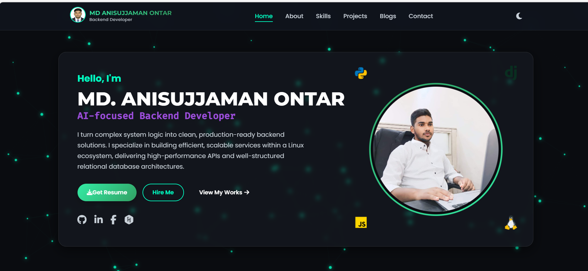
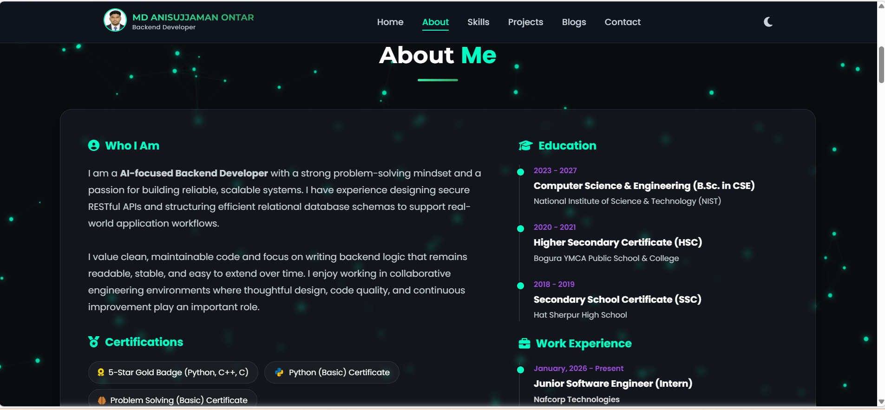
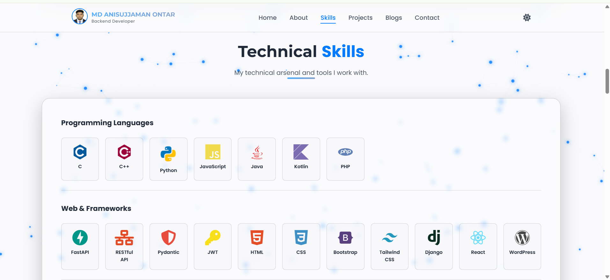
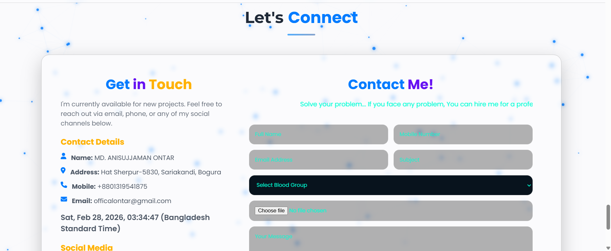
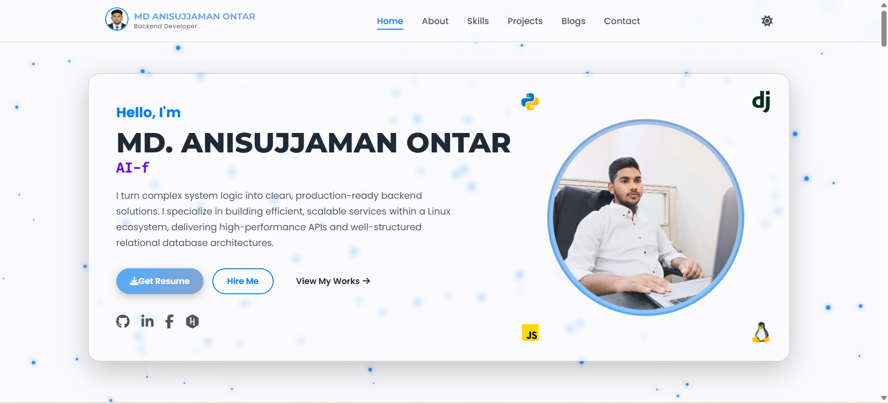
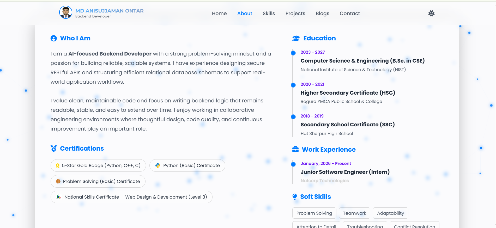

<p align="center">
  
</p>

<h3 align="center">🚀 AI-Focused Backend Developer | Modern Web Engineer</h3>

<p align="center">
  🌐 <strong>Live Portfolio:</strong><br>
  <a href="https://ontar-portfolio.netlify.app/" target="_blank">
    https://ontar-portfolio.netlify.app/
  </a>
</p>

---

# 📌 Project Overview

This is my fully responsive, production-ready personal portfolio website built using modern front-end architecture.

Designed with:

- ✨ Glassmorphism UI
- 🌙 Dark / Light Mode Toggle
- ⚡ Animated Typing Effect
- 🌌 Particle Background Animation
- 📱 Responsive Mobile Navigation
- 🕒 Live Bangladesh Time
- 📩 Contact Form Validation
- 🚀 Deployed on Netlify

---

# 🖼️ Screenshots

## 🌙 Dark Mode

<p align="center">
  <br><br>
  <br><br>
  <br><br>
  
</p>

---

## ☀ Light Mode

<p align="center">
  <br><br>
  
</p>

---

# 🛠️ Tech Stack

<p align="center">
  
</p>

---

# 📊 GitHub Statistics

<p align="center">
  
  
</p>

---

# 📈 Most Used Languages

<p align="center">
  
</p>

---

# 📉 Contribution Activity Graph

<p align="center">
  
</p>

---

# 🚀 Features

✔ Fully Responsive Layout  
✔ Clean Modern UI  
✔ Animated Navigation  
✔ Dark & Light Mode  
✔ Glassmorphism Cards  
✔ Smooth Scroll  
✔ Interactive Contact Section  
✔ Optimized Performance  

---

# 📂 Project Structure

```
ontar-portfolio/
│
├── index.html
├── style.css
├── script.js
├── README.md
│
└── Image/
    ├── Formal.jpg
    ├── my-photo.jpg
    ├── screenshot-dark-hero.png
    ├── screenshot-dark-About.png
    ├── screenshot-dark-Skills.png
    ├── screenshot-dark-Contact.png
    ├── screenshot-light-Home.png
    └── screenshot-light-About.png
```

---

# 🌍 Deployment

Hosted on **Netlify (Free Hosting + Subdomain)**

🔗 Live URL:
https://ontar-portfolio.netlify.app/

---

# 🤝 Connect With Me

<p align="center">
  <a href="https://github.com/officialontar"></a>
  <a href="https://linkedin.com/in/officalontar"></a>
</p>

---

# ⭐ Support

If you appreciate this project:

⭐ Star this repository  
🍴 Fork it  
🔗 Share it  

---

<p align="center">
  © 2026 MD ANISUJJAMAN ONTAR — All Rights Reserved
</p>

<p align="center">
  
</p>